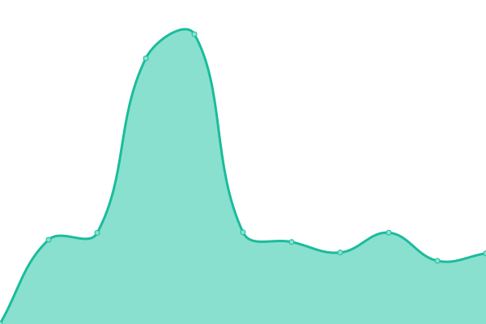

# [📈 Live Status](https://james-martinez.github.io/dso-mil): <!--live status--> **🟧 Partial outage**

This repository contains the open-source uptime monitor and status page for [James Martinez](https://james-martinez.github.io/dso-mil), powered by [Upptime](https://github.com/upptime/upptime).

With [Upptime](https://upptime.js.org), you can get your own unlimited and free uptime monitor and status page, powered entirely by a GitHub repository. We use [Issues](https://github.com/james-martinez/dso-mil/issues) as incident reports, [Actions](https://github.com/james-martinez/dso-mil/actions) as uptime monitors, and [Pages](https://james-martinez.github.io/dso-mil) for the status page.

<!--start: status pages-->
<!-- This summary is generated by Upptime (https://github.com/upptime/upptime) -->
<!-- Do not edit this manually, your changes will be overwritten -->
<!-- prettier-ignore -->
| URL | Status | History | Response Time | Uptime |
| --- | ------ | ------- | ------------- | ------ |
|  [Login](https://login.dso.mil) | 🟩 Up | [login.yml](https://github.com/james-martinez/dso-mil/commits/HEAD/history/login.yml) | 

 942ms
     
 | 

<a href="https://james-martinez.github.io/dso-mil/history/login">100.00%</a>
    

|  [Repo1](https://repo1.dso.mil) | 🟥 Down | [repo1.yml](https://github.com/james-martinez/dso-mil/commits/HEAD/history/repo1.yml) | 

 656ms
     
 | 

<a href="https://james-martinez.github.io/dso-mil/history/repo1">99.23%</a>
    

|  [Ironbank](https://ironbank.dso.mil) | 🟥 Down | [ironbank.yml](https://github.com/james-martinez/dso-mil/commits/HEAD/history/ironbank.yml) | 

 547ms
     
 | 

<a href="https://james-martinez.github.io/dso-mil/history/ironbank">99.26%</a>
    

|  [Registry1](https://registry1.dso.mil) | 🟥 Down | [registry1.yml](https://github.com/james-martinez/dso-mil/commits/HEAD/history/registry1.yml) | 

 523ms
     
 | 

<a href="https://james-martinez.github.io/dso-mil/history/registry1">99.28%</a>
    

|  [Portal](https://portal.cnap.dso.mil) | 🟥 Down | [portal.yml](https://github.com/james-martinez/dso-mil/commits/HEAD/history/portal.yml) | 

 918ms
     
 | 

<a href="https://james-martinez.github.io/dso-mil/history/portal">99.30%</a>
    

<!--end: status pages-->

[**Visit our status website →**](https://james-martinez.github.io/dso-mil)

## 📄 License

- Powered by: [Upptime](https://github.com/upptime/upptime)
- Code: [MIT](./LICENSE) © [Anand Chowdhary](https://anandchowdhary.com), supported by [Pabio](https://pabio.com)
- Data in the `./history` directory: [Open Database License](https://opendatacommons.org/licenses/odbl/1-0/)
